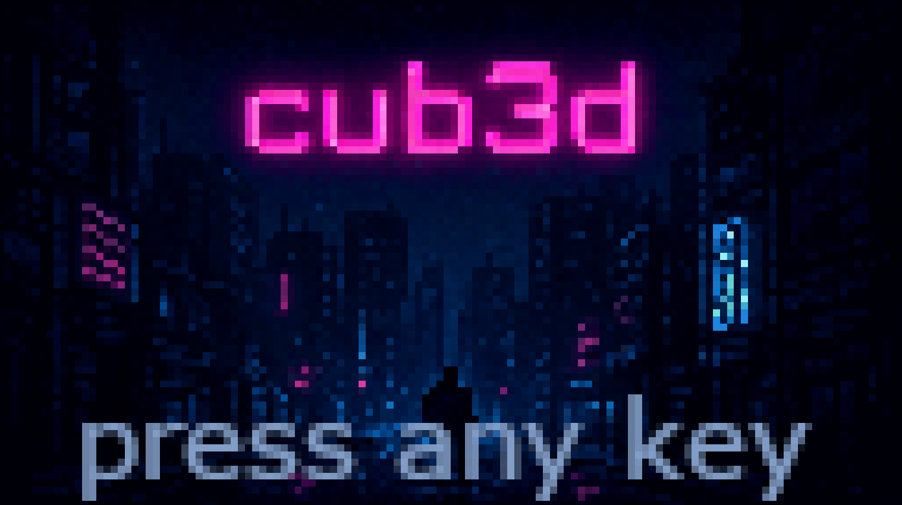

# Cub3D - Raycasting Engine

A 3D graphics engine inspired by Wolfenstein 3D, built in C using the MiniLibX graphics library. This project implements raycasting algorithms to render a pseudo-3D environment from a 2D map.

## 📸 Screenshots

### Bonus Version in Action

*The bonus version featuring textured floors/ceilings, interactive doors, and a real-time minimap with FOV visualization*

### Menu Screen

*Stylized menu screen with custom graphics*

## 🎯 Project Overview

Cub3D is a simple raycasting engine that creates a first-person perspective 3D environment. The project includes:

- **Mandatory version**: Basic raycasting with textured walls and player movement
- **Bonus version**: Enhanced features including interactive elements, minimap, floor/ceiling textures, and pitch control

## 🚀 Features

### Mandatory Features
- **Raycasting rendering**: Real-time 3D perspective from 2D map
- **Textured walls**: Different textures for each cardinal direction
- **Player movement**: WASD controls for movement, arrow keys for rotation
- **Map parsing**: Reads `.cub` configuration files
- **Error handling**: Comprehensive validation and error reporting

### Bonus Features
- **Interactive elements**: Doors and levers with activation mechanics
- **Minimap**: Real-time circular minimap with FOV visualization
- **Floor/ceiling textures**: Textured surfaces with distance shading
- **Pitch control**: Look up/down with arrow keys
- **Menu system**: Start screen and victory screen
- **Enhanced graphics**: Improved lighting and visual effects

## 🛠️ How It Works

### Raycasting Algorithm
1. **Ray casting**: For each screen column, cast a ray from player position
2. **DDA algorithm**: Use Digital Differential Analyzer for efficient wall detection
3. **Distance calculation**: Calculate perpendicular distance to avoid fisheye effect
4. **Wall rendering**: Draw textured vertical strips based on distance
5. **Floor/ceiling**: Render horizontal surfaces using perspective projection

### Map Format
Maps are defined in `.cub` files with the following structure:
```
NO textures/wall_north.xpm
SO textures/wall_south.xpm
WE textures/wall_west.xpm
EA textures/wall_east.xpm

F 30,50,120
C 32,32,32

1111111111
1000000001
1000N00001
1111111111
```

## 📦 Installation

### Prerequisites
- **GCC** compiler
- **Make** build system
- **MiniLibX** graphics library
- **X11** development libraries (Linux)

### Linux Installation
```bash
# Install dependencies (Ubuntu/Debian)
sudo apt-get update
sudo apt-get install gcc make libbsd-dev libx11-dev libxext-dev libtool-bin

# Clone the repository
git clone [your-repository-url] cub3d
cd cub3d

# Build the project
make                    # Build mandatory version
make bonus             # Build bonus version

# Clean build files
make clean             # Remove object files
make fclean            # Remove all generated files
make re                # Rebuild everything
```

### macOS Installation
```bash
# Install Xcode command line tools
xcode-select --install

# Clone and build
git clone git@github.com:RomainBoland/cub3d.git cub3d
cd cub3d
make
```

## 🎮 Usage

### Running the Game
```bash
# Mandatory version
./cub3D maps/test.cub

# Bonus version
./cub3D_bonus maps_bonus/map_bonus.cub
```

### Controls

#### Mandatory Version
- **W/A/S/D**: Move forward/left/backward/right
- **←/→**: Rotate left/right
- **ESC**: Exit game

#### Bonus Version
- **W/A/S/D**: Move forward/left/backward/right
- **←/→**: Rotate left/right
- **↑/↓**: Look up/down (pitch control)
- **E**: Interact with doors/levers
- **ESC**: Exit game
- **Any key**: Start game (from menu)

### Map Elements
- **1**: Wall
- **0**: Empty space
- **N/S/E/W**: Player starting position and direction
- **D**: Door (bonus)
- **L**: Lever (bonus)

## 🗂️ Project Structure

```
cub3d/
├── includes/           # Header files
│   ├── cub3d.h        # Mandatory version headers
│   └── cub3d_bonus.h  # Bonus version headers
├── libft/             # Custom C library
├── srcs/              # Mandatory source files
│   ├── error/         # Error handling
│   ├── game/          # Game logic and rendering
│   ├── init/          # Initialization functions
│   ├── parsing/       # Map and config parsing
│   └── utils/         # Utility functions
├── srcs_bonus/        # Bonus source files
├── maps/              # Sample maps (mandatory)
├── maps_bonus/        # Sample maps (bonus)
├── textures/          # Texture files (.xpm)
├── Makefile           # Build configuration
└── README.md          # This file
```

## 🎨 Creating Custom Maps

### Basic Map Format
1. Create a `.cub` file with texture paths and colors
2. Define the map using valid characters
3. Ensure the map is surrounded by walls
4. Place exactly one player starting position

### Example Map
```
NO textures/wall_north.xpm
SO textures/wall_south.xpm
WE textures/wall_west.xpm
EA textures/wall_east.xpm

F 30,50,120
C 32,32,32

1111111111
1000000001
1000N00001
1000000001
1111111111
```

### Bonus Map Elements
For the bonus version, you can add:
- **D**: Doors (require texture definitions: DL, DU, DO)
- **L**: Levers (require texture definitions: LON, LOS, LOB, LNN, LNS, LNB)

## 🔧 Technical Details

### Performance Optimizations
- **Fast distance approximation**: Optimized distance calculations
- **Efficient texture sampling**: Bitwise operations for texture coordinates
- **Minimal memory allocations**: Static buffers where possible
- **DDA algorithm**: Efficient ray-grid traversal

### Graphics Features
- **Distance shading**: Objects appear darker with distance
- **Texture mapping**: XPM texture support
- **Antialiasing**: Smooth texture rendering
- **Field of view**: Configurable perspective projection

## 🐛 Troubleshooting

### Common Issues
1. **"Failed to initialize MLX"**: Ensure X11 libraries are installed
2. **"Invalid texture path"**: Check that all texture files exist
3. **"Map must be surrounded by walls"**: Verify map boundaries

### Debug Mode
Build with debug flags for detailed error information:
```bash
make DEBUG=1
```

## 📝 Map Configuration Reference

### Texture Definitions
- **NO**: North wall texture
- **SO**: South wall texture  
- **WE**: West wall texture
- **EA**: East wall texture
- **F**: Floor color (R,G,B)
- **C**: Ceiling color (R,G,B)

### Bonus Texture Definitions
- **DL**: Locked door texture
- **DU**: Unlocked door texture
- **DO**: Open door texture
- **LON/LOS/LOB**: Lever off textures (North/South/Base)
- **LNN/LNS/LNB**: Lever on textures (North/South/Base)

---

*Built with ❤️ for 42 School*